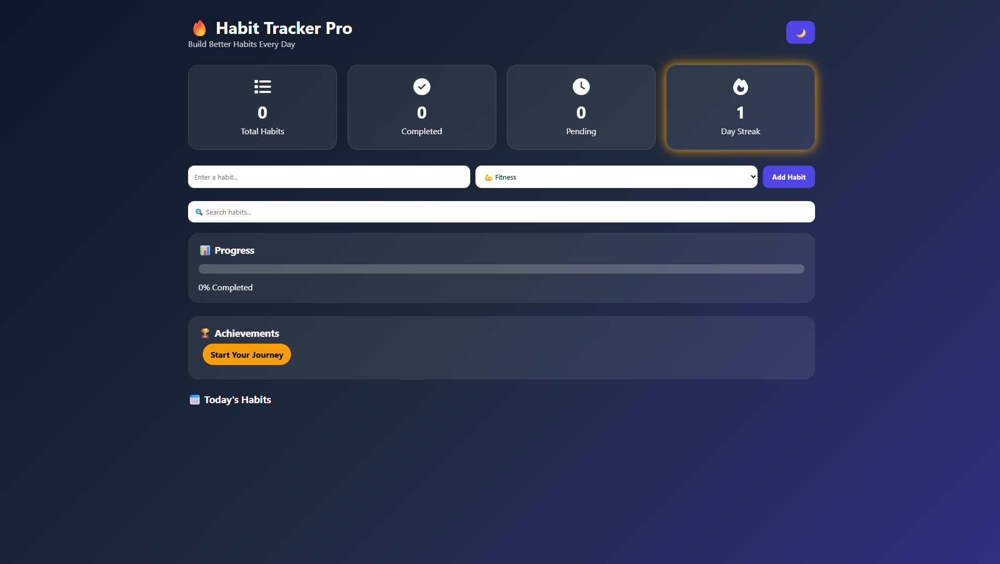

# 🌟 Habit Tracker V2

A modern and improved Habit Tracker web application designed to help users build consistency and track daily habits in a simple, clean dashboard UI.

---

## 🚀 Live Demo

👉 Try it here:  
https://henry20070716.github.io/Habit-Tracker-Version-2/

---

## 📸 Preview

---

## ✨ Features

- ➕ Add new habits easily
- ❌ Delete unwanted habits
- 🔥 Track streaks for consistency
- 📊 Live progress dashboard
- 💾 Data saved in browser (LocalStorage)
- 📱 Fully responsive design
- ⚡ Fast and lightweight (no frameworks)

---

## 🛠️ Tech Stack

- HTML5
- CSS3
- JavaScript (Vanilla JS)
- LocalStorage API

---

## 📂 Project Structure

Habit-Tracker-Version-2/
│
├── index.html
├── style.css
├── script.js
├── screenshot.png
└── README.md

---

## 🚀 Improvements from V1

- ✨ Better UI design and layout
- 📱 Improved mobile responsiveness
- 🔥 Added streak tracking system
- 📊 Added progress stats section
- ⚡ Smoother user interactions

---

## 🧠 Future Improvements

- 🌙 Dark mode toggle
- 📈 Weekly/monthly analytics
- ☁️ Cloud sync support
- 🔔 Reminder notifications
- 📊 Graph-based progress tracking

---

## 👨‍💻 Author

**J. Henry Prabhu**

Built with passion to improve daily productivity 💪

---

## ⭐ Support

If you like this project, don’t forget to give it a ⭐ on GitHub and share it!
